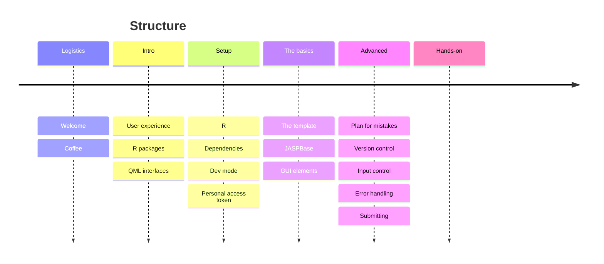
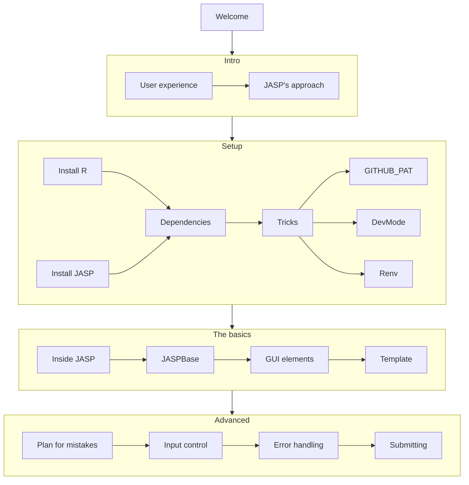
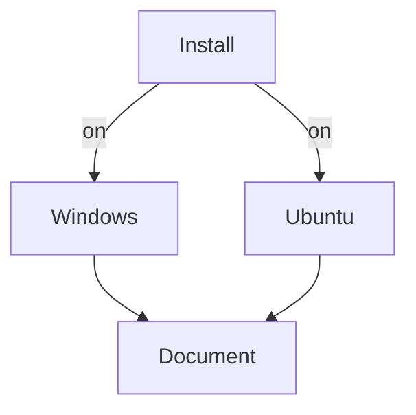

<!-- slide bg="https://github.com/PabRod/autodiff-slides/blob/main/_meta/_img/escience-cover.png?raw=true" -->
# JASP modules hackathon

## Build your own module

By Pablo Rodríguez-Sánchez

note: this will be invisible in the slide
### Mind map


### Attendant's experience

## TODOs

---
## Before we start
+ Feel at home
+ [pabrod.github.io](pabrod.github.io)

---
# Introduction
## Why JASP modules?
+ It's all about user experience
+ Coding vs. click and drag

--


--


--
## Impact


---

# Setup
## In a nutshell
Your system has to be able to:
- Install JASP  
- Install R packages from source

--

##  Basics
- We all are going to need:
	- R
	- JASP (nightly version) TODO 
	- RStudio (recommended)

--

## Dependencies
### System
`cmake` and `gcc-fortran`


--

## Dependencies

### CRAN packages
```r
renv::install(c(
	"renv", 
	"remotes"))
```

--

## Dependencies

### GitHub packages
Some of the required packages are not available in CRAN. You can install them via GitHub. 

```r
remotes::install_github(c(
	"jasp-stats/jaspBase", 
	"jasp-stats/jaspGraphs", 
	"jasp-stats/jaspTools"))
```

Often, this requires you to set up a _GitHub Personal Access Token_.

--

## Other
- A GitHub account
- A GitHub Personal Access Token

```r
renv::install()
- GitHub authentication credentials are not available.
- Please set GITHUB_PAT, or ensure the 'gitcreds' package is installed.
- See https://usethis.r-lib.org/articles/git-credentials.html for more details.
```

--

## Advanced preferences


---

# The basics


--
## QML files
+ Used to create the interactive menu
+ 

--

## Outputs

--

## The template
[github.com/jasp-stats/jaspModuleTemplate](https://github.com/jasp-stats/jaspModuleTemplate)

---
# Thanks for your attention