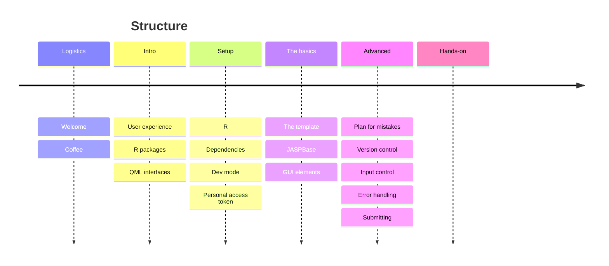
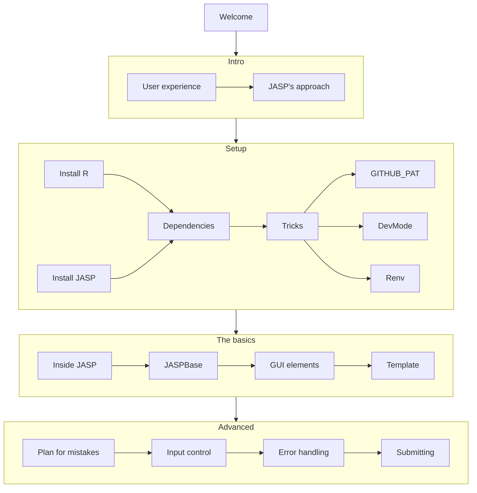
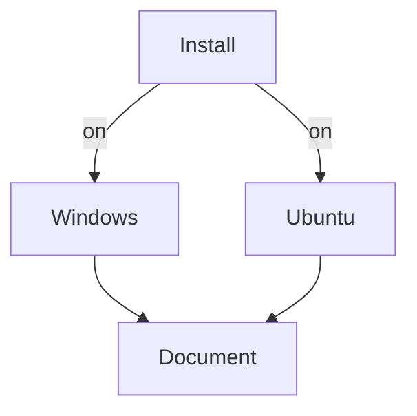
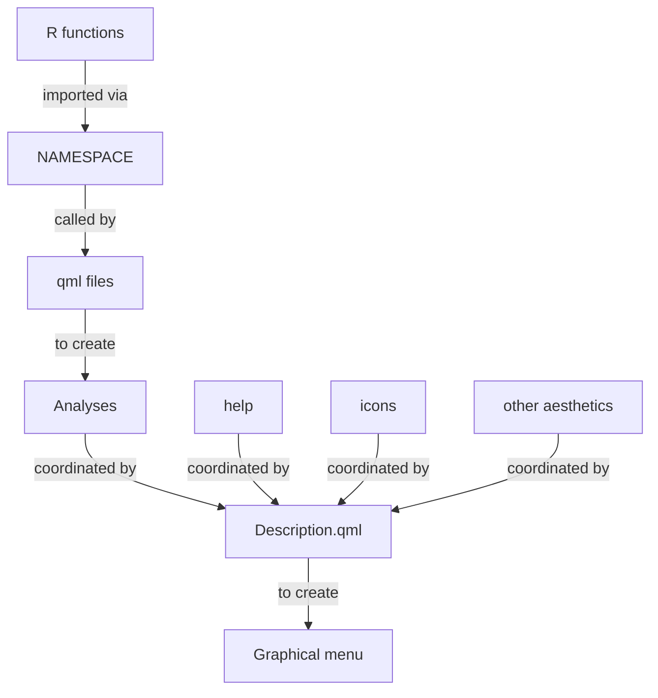
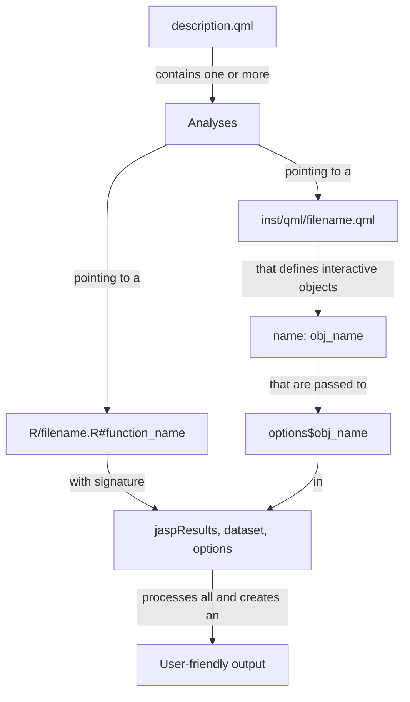

<!-- slide bg="https://github.com/PabRod/autodiff-slides/blob/main/_meta/_img/escience-cover.png?raw=true" -->
# JASP modules hackathon

## Build your own module

By Pablo Rodríguez-Sánchez

note: this will be invisible in the slide
### Mind map


### Attendant's experience

## TODOs

---
## Before we start
+ Feel at home ☕
+ Get your slides at [pabrod.github.io](https://pabrod.github.io)

---
## Why JASP modules?
+ It's all about user experience
+ Coding vs. click and drag

--


--


--


---

# Setup
## In a nutshell
Your system has to be able to:
- Install JASP  
- Install R packages from source

--

##  Basics
- We all are going to need:
	- R
	- JASP (nightly version) TODO 
	- RStudio (recommended)

--

## Dependencies
### System
`cmake` and `gcc-fortran`


--

## Dependencies

### CRAN packages
```r
renv::install(c(
	"renv", 
	"remotes"))
```

--

## Dependencies

### GitHub packages
Some of the required packages are not available in CRAN. You can install them via GitHub. 

```r
remotes::install_github(c(
	"jasp-stats/jaspBase", 
	"jasp-stats/jaspGraphs", 
	"jasp-stats/jaspTools"))
```

Often, this requires you to set up a _GitHub Personal Access Token_.

--

## Other
- A GitHub account
- A GitHub Personal Access Token

```r
renv::install()
- GitHub authentication credentials are not available.
- Please set GITHUB_PAT, or ensure the 'gitcreds' package is installed.
- See https://usethis.r-lib.org/articles/git-credentials.html for more details.
```

--

## Advanced preferences


---

## What is as JASP module?

A JASP module is an extension that adds new functionality to JASP

--

Many of the modules are directly accessible in the upper ribbon of JASP:

  


--
  

By pressing the `+` icon at the right-hand side of the screen, many more modules can be added to the ribbon.

--
  


--


---

# How to write a module?

--


--

## Folder structure

```sh
.
└── < An R package >
    └──inst
        ├── Description.qml    # Builds the ribbon menu
        ├── qml                # Folder containing one or more...
        │   └── analysis_1.qml # ... module's menus
        └── < optional stuff >

```

--

In detail

```sh
.
├── <module_name>.Rproj
├── DESCRIPTION             # Describes the package and lists its dependencies
├── LICENSE
├── NAMESPACE               # Controls function importing
├── R                       # Where the package functions live
│   └── functions.R
│   └── more-functions.R
│   └── ...
├── README.md
├── renv.lock               # (Optional) Environment management...
├── _processedLockFile.lock # ...files, controlled by package renv
├── tests/                  # (Optional) Unit tests
│
│  # === So far, this is just a standard R package ===
│  # === Interaction with JASP starts below === 
│ 
└──inst
    ├── Description.qml     # Builds the ribbon menu
    ├── Upgrades.qml        # Optional
    ├── qml                 # Folder containing one or more...
    │   └── analysis_1.qml  # ... module's menus
    │   └── ...
    ├── help                # (Optional) Module's help files
    │   └── ...
    └── icons               # (Optional) Module's icons
        ├── <module_name>.svg
        └── ...
```


--


--
#### Helicopter view


--
#### Information flow



--
- Where
	- `jaspResults` creates the output
	- `dataset` can be input via `New Data` button
	- `options` are interactive objects available in the module

--
# Good news

You don't have to remind any of this. That's why we have a template!

[github.com/jasp-stats/jaspModuleTemplate](https://github.com/jasp-stats/jaspModuleTemplate)

--
## How to use the template

1. Just download or clone it
2. Adapt it to your needs. For instance:
	1. Duplicate the elements you need more than once
	2. Remove the elements you don't need

--
### Tips and tricks
- Don't forget that each element lives in three files:

	- `inst/description.qml`
	- `inst/qml/<filename>.qml`
	- `R/<filename>.R`

--

### Tips and tricks
- Try to keep the functionality your JASP module adds on top of the underlying R package to a minimum
- Work mostly on the GUI, not on the backend functionality

---
## Reference materials

- These slides: [pabrod.github.io](https://pabrod.github.io)
- [Curated background materials](https://github.com/jasp-stats/jasp-desktop/blob/development/Docs/development/jasp-background-materials.md)
- [Tutorial: Development of a JASP module](https://github.com/jasp-stats/jasp-desktop/blob/development/Docs/development/jasp-modules-tutorial.md)
- [jaspModuleTemplate](https://github.com/jasp-stats/jaspModuleTemplate)
  
- Advanced materials
	- [Detailed JASP module structure](https://github.com/jasp-stats/jasp-desktop/blob/development/Docs/development/jasp-module-structure.md)
	- [JASP QML guide](https://github.com/jasp-stats/jasp-desktop/blob/development/Docs/development/jasp-qml-guide.md)
	- [R Analyses guide](/Docs/development/r-analyses-guide.md) (or how to use `jaspResults`)

---
# Thanks for your attention